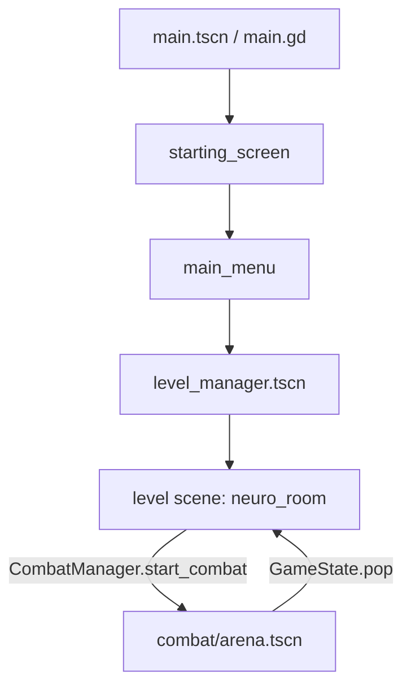

# Architecture

How the rewrite is put together. This is the current, authoritative overview;
`doc/architecture_design_rough.txt` is early design scratch notes and is not kept up to date.

- **Engine:** Godot 4.7.x, GDScript.
- **Internal resolution:** 512x288, `canvas_items` stretch, `expand` aspect.
- **Main scene:** `res://main.tscn` (`main.gd`).

---

## 1. The big picture

Almost everything hangs off one idea: **the game is a stack of scene-states owned by the
`GameState` autoload.** A level is a state, combat is a state pushed on top of a level, a
menu is a state pushed on top of everything. Pushing a state hides and freezes the one
below it; popping restores it.



Alongside the stack there are a few autoload services:

| Autoload | Script | Owns |
| --- | --- | --- |
| `GameState` | `autoloads/game_state.gd` | the state stack **and** the global data (`party`, `inventory`, `keys`, `quests`) |
| `LevelManager` | `autoloads/level_manager.gd` | `LevelRoot`; swaps level scenes and places the player at spawn points |
| `PlayerManager` | `autoloads/player_manager.gd` | the player and the overworld party followers on `PlayerRoot` |
| `GameSettings` | `autoloads/game_settings.gd` | active/relaxed combat timing, persisted to `user://settings.cfg` |
| `CombatManager` | `autoloads/combat_manager.gd` | starting battles and applying victory rewards |
| `Dialogic` | addon | dialogue/timelines |
| Beehave metrics/debugger | addon | behaviour trees (used by NPCs) |

> Note: `project.godot` currently declares **both** `Game` and `GameState` on the same
> script uid. `Game` is redundant — see `development.md` §6.

---

## 2. The state stack (`GameState`)

`GameState` is both the global data holder and the scene-flow owner.

```gdscript
var party: Party              # current party members
var inventory: Inventory      # items + money
var keys: PersistenceKeys     # persistent flags ("keys")
var quests: QuestManager      # started quests

var state_stack: Array[Node]
var current_state: Node
var poped_result: Variant
```

### API

- `init(state_manager: Node, transition_root: Node)` — wires where states and transitions
  live. Called once by `main.gd`.
- `push(state_path, args = null, render_underlying = false, transition_path = fade)` —
  plays the transition in, hides + `PROCESS_MODE_DISABLED`s the current top state unless
  `render_underlying`, instantiates the new scene, adds it under the state manager, and
  calls **`enter(args)`** on it.
- `pop(result = null, transition_path = fade)` — removes and frees the current state,
  restores the previous one (`PROCESS_MODE_INHERIT` + `show()`), and stores `result` in
  `poped_result` for whoever pushed.

### Two rules that matter

1. **Every pushed scene root implements `enter(args)`.** That is the state's constructor;
   `_ready` is not the right place to read `args`.
2. **Hiding + disabling is deliberate.** `PROCESS_MODE_DISABLED` inherits to children, so
   the player, NPCs and their behaviour trees all stop updating *and* stop reading input
   while a state is on top. A level root that wants to be hidden must be a `CanvasItem`
   (the level root is a `Node2D`).

---

## 3. Transitions

A transition is a short `Control` played around a push/pop.

- `res://transitions/base_transition.gd` — `@abstract class_name BaseTransition`, with
  `@abstract func play_in()` and `play_out()` (both `await`ed by the caller).
- `res://transitions/fade_transition.tscn` + `.gd` — fades a `ColorRect` alpha over 0.8s.

`GameState.push`/`pop` instantiate the transition under `TransitionRoot` (a `CanvasLayer`
in `main.tscn`), so transitions always draw on top. Passing `transition_path = ""` skips
them.

---

## 4. World, levels, player

Three separate roots keep the world and the player independent:

```
main.tscn
├── StateManager      (states are added here)
├── BGMPlayer         (AudioStreamPlayer on the BGM bus; not wired up yet)
└── TransitionLayer/TransitionRoot
```

```
level_manager.tscn (the "World" state)
├── LevelRoot   <- LevelManager instantiates the current level here
└── PlayerRoot  <- PlayerManager keeps the player + followers here
```

Because the player lives outside the level, it **survives level swaps** and only needs to
be repositioned.

### LevelManager

- `init(level_root, transition_root)`.
- `change_level(level_path, spawn_id = "", transition_path = "")`:
  parks the player (`set_player_active(false)`), optionally fades in, frees the current
  level, instantiates the new one under `LevelRoot`, finds a `SpawnPoint` with a matching
  `spawn_id` (searching the `"spawn_points"` group), positions and faces the player, fades
  out, then re-enables the player.
- If no spawn matches, it pushes a warning and leaves the player where it is.

### PlayerManager

Owns the leader and one follower per extra party member.

- `spawn_player(position)` — instantiates `player.tscn` on `PlayerRoot` and spawns
  followers for `GameState.party.members[1..]`.
- `set_player_active(active)` — toggles physics on the leader and all followers
  (this is how combat/dialogue park the party).
- `set_player_position(pos)` — teleports the leader, clears its trail, snaps followers.
- `set_player_facing`, `get_player_position`, `get_player_z_index`, `get_player`,
  `follower_count`, `despawn_player`.
- External code is meant to go **through PlayerManager**, never touch the player node.

### Player (`characters/playable/player.gd`)

A dumb `CharacterBody2D`: reads the input map, moves at `SPEED = 180` (x1.7 while
`sprint`), and records a position history (`_trail`, length 120) that followers sample.

### Followers (`characters/playable/party_follower.gd`)

Each follower reads `leader.get_trail_position(index * frames_per_step)` every physics
frame, so the party snakes along the leader's exact path. They share the leader's
`sprite` texture and `z_index`.

---

## 5. State containers

Plain data objects under `states/`, each with `to_dict()` / `from_dict()` where it matters,
so a future save system is "walk the owners".

| Container | File | Notes |
| --- | --- | --- |
| `Party` | `states/party.gd` | `members: Array[PartyMember]`, `ult_charge`, `add_member`, `has_member_named` |
| `PartyMember` | `states/party_member.gd` | extends `CombatantData`; `level`, `xp`, `to_dict`/`from_dict` (stats, levels, action paths, equipment paths) |
| `Inventory` | `states/inventory.gd` | stacks by `Item.id`, `money` — see `items_and_inventory.md` |
| `PersistenceKeys` | `states/persistence_keys.gd` | the flags everything else reads — see `quests_and_persistence.md` |
| `QuestManager` | `states/quests/quest_manager.gd` | started quests by id |
| `Leveling` | `states/leveling.gd` | XP curve + level-ups (a static helper, not stored state) |

`GameState` instantiates `Party`, `Inventory`, `PersistenceKeys` and `QuestManager` at
startup, so they are always present.

---

## 6. Combat as a state

Combat is not special from the stack's point of view: `CombatManager.start_combat()`
calls `GameState.push("res://combat/arena.tscn", enemies)` with `render_underlying = false`,
so the level is hidden and frozen. The arena takes its own camera and pops itself when the
battle ends. Full details in `combat.md`.

---

## 7. Folder map

```
autoloads/     services + GameState
states/        data containers (party, inventory, keys, quests, leveling)
combat/        the battle system (arena, combatant, states, data, timing, qte, ui, ai)
characters/    player, followers, NPCs
levels/        level scenes + level_manager + placeable objects
items/         item resource model (item/equipable/consumable)
quests/        authored quest resources
data/          authored resources (actions, combatants, items, status, themes, timelines)
ui/            menus + starting screen
transitions/   push/pop wipes
addons/        Dialogic, Beehave, TileMapDual + the project's *_additions glue
tests/         headless test suite
doc/           this documentation
old-version/   the previous game (symlink; NOT scanned by Godot)
```

---

## 8. Conventions

- Typed GDScript everywhere (`var x: Array[Combatant]`, `func f() -> void`).
- `class_name` on most scripts so they are globally available.
- GDScript doc comments (`##`) with `[code]`, `[method]`, `[member]` BBCode.
- Data is authored as `.tres`, not built in code; behaviour lives in small overridable
  methods (`get_value`, `execute`, `tick`, `run`).
- External access goes through managers (`PlayerManager`, `LevelManager`, `CombatManager`,
  `QuestManager`) rather than reaching into nodes.

See `combat.md`, `items_and_inventory.md`, `quests_and_persistence.md`, and
`level_authoring.md` for the subsystems, and `development.md` for running the project and
the test suite.
