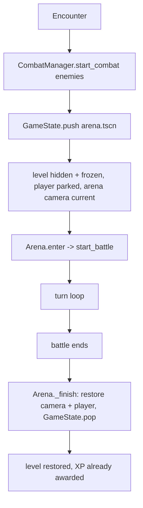
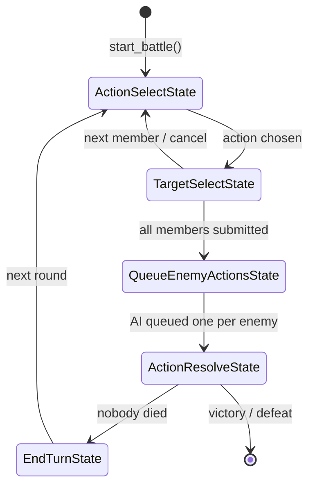

# Combat System

Turn-based, data-driven combat. This document covers how it is put together and
where to change things. Everything lives under `res://combat/`, with the entry
point in `res://autoloads/combat_manager.gd`.

---

## 1. Lifecycle (how a battle starts and ends)

A battle is just another state on the `GameState` stack, so the ordinary scene
flow, transitions and hiding are reused.



- **Entry:** `CombatManager.start_combat(enemies: Array[EnemyData])`. It calls
  `GameState.push(ARENA_SCENE, enemies)` with `render_underlying = false`, so
  `GameState` hides and `process_mode = DISABLED`s the level state underneath.
  That freeze is inherited, so the overworld player *and* any hidden NPCs stop
  updating and stop reacting to input. `CombatManager.is_in_combat()` reports
  whether the current state is an `Arena`.
- **Exit:** `Arena._finish()` runs on both victory and defeat. It restores the
  camera, re-enables the player and calls `GameState.pop(victory)`.

`CombatManager` is a thin entry point so callers (an encounter area, an NPC, a
Beehave leaf, Dialogic) do not need to know the arena scene path or the
camera/player bookkeeping.

---

## 2. The arena scene (`res://combat/arena.tscn`)

```
Arena (Node2D, arena.gd)            <- the hub; owns combatants, queue, ult, camera
├── Camera2D                        <- screen-space battle camera (256,144)
├── Background (PanelContainer)     <- battle backdrop
├── Party   (Node2D) Slot1..3       <- Marker2D spawn positions
├── Enemies (Node2D) Slot1..5
├── ActionSelectState      (Node)   <- the turn-loop states, direct children
├── TargetSelectState      (Node)
├── QueueEnemyActionsState (Node)
├── ActionResolveState     (Node)
├── EndTurnState           (Node)
├── AI          (Node, enemy_ai.gd)
└── UI          (Control, arena_ui.gd)   <- the battle HUD
    ├── UltBar (ProgressBar)
    ├── MainBG/Control/Name, StatBars/HP+MP
    ├── ActionTabs  (Skills / Combos / Items  ->  TabContainer tabs)
    ├── InfoBG/MarginContainer/Label
    ├── GradeLabel  (timing-grade popup)
    └── TimingHost  (Control the QTE mounts into)
```

`Arena._ready()` collects the `Marker2D`s under `Party`/`Enemies` as spawn slots,
spawns the target indicator, and takes over the camera.

**Camera:** the overworld player owns a `Camera2D`, so the viewport follows the
player. The arena adds its own `Camera2D` at the battle center and calls
`make_current()`; `_finish()` restores the previously current camera. This keeps
both the combatants and the HUD in fixed screen space.

---

## 3. Turn loop (the states)

States are direct children of `Arena`; `ArenaStateBase` exposes `arena`
(`get_parent()`) and `enter()` / `exit()`.



- **ActionSelectState** — asks `arena.get_current_combatant()` for the party
  member taking their turn, then `arena.ui.show_action_menu(arena.available_actions_for(actor), ...)`.
- **TargetSelectState** — for enemy/ally actions, awaits `arena.target_indicator.choose(candidates)`;
  self/AoE actions skip the picker. Then `submit_action_player()`.
- **QueueEnemyActionsState** — `arena.ai.choose_action(enemy, arena)` once per
  living enemy.
- **ActionResolveState** — sorts the queue by `source.get_speed()` (fastest
  first) and `await arena.perform_action(action)` for each, re-checking
  `has_battle_ended()` after every action.
- **EndTurnState** — `arena.start_over()` (end-of-round status ticks, clear
  blocking/queue) then back to `ActionSelectState`.

`Arena.perform_action()` is the per-action pipeline:
start-of-turn statuses → timing challenge (if the action uses it) → animation →
`_apply_action` (execute on the target(s), ult charge) → end-of-turn statuses.

---

## 4. Data model (`res://combat/data/`)

| Class | Purpose |
| --- | --- |
| `CombatantData` (Resource) | Definition of a fighter: `display_name`, `texture` (+ sheet layout), stats (max_health, max_mana, attack, magic, defense, speed, accuracy), `actions`. Holds live `health`/`mana` so party state persists. |
| `PartyMember extends CombatantData` | Adds `level`, `xp`, and `to_dict()`/`from_dict()` for saving. |
| `EnemyData extends CombatantData` | Adds `is_boss`, `xp_reward`. |
| `AIActionWeights` (Resource) | Target-scoring weights for the enemy AI. |
| `StatusEffect` (Resource) | Base for lingering effects (see §7). |

Stats follow the design notes: HP, MP, speed, attack, magic, defense, accuracy.
`accuracy` widens the timing window in active mode and improves the roll in
relaxed mode (`Combatant.get_accuracy()`).

`Combatant` (`res://combat/combatant.gd`) is the **runtime** wrapper: it owns the
live HP/MP/blocking/statuses, the sprite and bars, movement tweens, and the
`get_*` stat accessors (the place to add equipment modifiers later).

Example resources: `res://data/combatants/neuro.tres`,
`res://data/combatants/swarm_drone.tres`.

---

## 5. Actions (`res://combat/data/`)

`ActionBase` is the base; subclasses set sensible defaults.

| Class | What it is |
| --- | --- |
| `ActionBase` | `display_name`, `type`, `damage_type` (PHYSICAL/MAGIC), `target_side` (ENEMY/ALLY/SELF), `mana_cost`, `power`, `piercing`, `uses_timing`, `hits_all`, `ai_weights`. Runtime `source`/`target`. |
| `Attack` | Offensive action. |
| `Heal` | Restores HP (scales off magic, targets allies). |
| `Combo` | Attack gated on `required_characters_names` all being in the party. |
| `Ultimate` | Attack gated on the party ult gauge being full; spends `ult_charge_cost`. |
| `ItemAction` | Combat action attached to a consumable (`item_id`). |

`get_value(actor)` is the raw power (scales off attack or magic by `damage_type`);
`execute(actor, victim, grade)` applies mana, multiplies by `TimingGrade.multiplier(grade)`,
and returns the damage dealt or HP restored.

**Add a new action:** author a `.tres` (pick `Attack`/`Heal`/… or `ActionBase`),
set its fields, and add it to a `CombatantData.actions`. Only subclass when the
damage formula itself differs — override `get_value()` and/or `execute()`.

---

## 6. Timing (active vs relaxed)

The player-facing split is `GameSettings.qte_mode` (`ACTIVE` / `RELAXED`), which
persists to `user://settings.cfg`.

| File | Role |
| --- | --- |
| `combat/timing/timing_grade.gd` | `enum Grade { FAIL, BAD, OK, GOOD, SUPER, PERFECT }`, plus the damage `MULTIPLIERS` and per-grade `COLORS`. Tune balance/colors here. |
| `combat/timing/timing_challenge.gd` | Everything else in one file: the `TimingChallenge` base, the `Active` (QTE) and `Relaxed` (roll) classes, and `TimingChallenge.create()`. |
| `combat/qte/qte_bar.gd` + `.tscn` | The QTE bar. Each grade has a colored section (from `TimingGrade.COLORS`); the marker sweeps and is colored by the grade it would currently score; `accuracy` widens the bands and their sections. |

**Add a mode / a harder QTE:** add a subclass of `TimingChallenge` in
`timing_challenge.gd`, implement `run()`, and add it to the `create()` switch.
Nothing else changes.

---

## 7. Status effects (hooks only)

`StatusEffect` is data (`timing`, `priority`, `duration`, `tick(target)`), and
`Combatant` holds a `status_effects` list. `Arena` fires them at three phases:

- `START_OF_TURN` / `END_OF_TURN` around each action (`perform_action`),
- `END_OF_ROUND` once per round (`start_over`).

Effects fire in `priority` order; effects that share a priority are meant to be
order-independent. **No concrete effects exist yet** — add one by subclassing
`StatusEffect` and `combatant.add_status(...)`.

---

## 8. UI (`res://combat/ui/`)

The battle HUD is the UI that shipped in `arena.tscn`; `arena_ui.gd` just drives
its nodes:

- `MainBG/Control/Name` and the HP/MP bars ← the current actor (`set_actor`).
- `UltBar` ← the party ult gauge (`setup_ult` / `update_ult`).
- `InfoBG/MarginContainer/Label` ← messages and the battle result.
- `ActionTabs` (Skills / Combos / Items) ← `show_action_menu`; actions are placed
  by type (`CombatantAction` → Skills, `Combo` → Combos, `ItemAction` → Items)
  with a Flee button. `action_tabs.gd` handles tab switching.
- `GradeLabel` ← the timing popup, colored via `TimingGrade.color`.
- `TimingHost` ← where the QTE scene is mounted.

The scene currently has a **single** ult bar, so the boss ult gauge is not shown.

---

## 9. Enemy AI (`res://combat/ai/enemy_ai.gd`)

`choose_action(enemy, arena)` heals a wounded ally when it can, otherwise picks
its strongest affordable attack, and rolls a weighted-random target from the
action's `AIActionWeights`. Override for a smarter enemy type.

---

## 10. Beehave & quest integration

- **StartCombat** (`addons/beehave_additions/start_combat.gd`) — an ActionLeaf
  that starts a battle from an NPC's behaviour tree. Export `enemies`, and
  optionally `victory_key` and `quest`. It returns RUNNING while combat is up.
- **Victory rewards are applied by `CombatManager`**, not the leaf. Pass
  `victory_key` / `quest` to `CombatManager.start_combat(...)` (or via the leaf)
  and they are set/started in `CombatManager.finish()` when the battle is won.
  That way rewards work no matter when the tree happens to tick.
- A `victory_key` is a persistence key set to `true` — exactly what
  `PersistenceGoal` reads. So a "defeat the drone" goal is just a
  `PersistenceGoal` on that key (see `quests/defeat_drones.tres`).
- **EncounterArea** (`combat/encounter_area.gd`) is the non-Beehave path: an
  Area2D that starts a battle when the player walks in, with the same optional
  `victory_key` / `quest`.
- **CombatNpc** (`characters/ch1/combat_npc.tscn`) — a ready-made fightable NPC
  for building a lineup. It uses `Interacted -> StartCombat` and exposes
  `enemies`, `victory_key`, `quest` and an optional `texture` on the root, so
  each placed instance can field a different fight.
- `levels/ch1/other/combat_demo.tscn` — a demo lineup of three of them, reachable
  from the start room (`neuro_room.tscn`) through a transition near the bottom
  left.

The start-scene NPC (Evil in `levels/ch1/neuros_home/neuro_room.tscn`) uses this:
its tree runs `Interacted -> AddQuest -> StartTimeline -> StartCombat`, and the
`StartCombat` node has `victory_key = "drones_defeated"` and
`quest = res://quests/defeat_drones.tres`.


## 11. Integration points

- **`GameState`** — the arena is a pushed state; `GameState.push/pop` handle
  hiding and `process_mode` suspension of whatever is underneath.
- **`PlayerManager`** — `set_player_active(false)` on battle start, `true` on end.
- **`GameState.party`** — the source of the party (`members`, `ult_charge`); HP/MP
  and ult are written back at the end of a battle.
- **Camera** — see §2.

---

## 12. File map

```
autoloads/combat_manager.gd        entry point
autoloads/game_settings.gd         active/relaxed mode

combat/arena.gd / arena.tscn       hub + scene
combat/combatant.gd / .tscn        runtime combatant
combat/states/*.gd                 turn loop
combat/ai/enemy_ai.gd              enemy AI
combat/ui/arena_ui.gd              HUD driver
combat/ui/action_tabs.gd           HUD tab buttons
combat/ui/target_indicator.gd/.tscn
combat/timing/timing_grade.gd      grades / multipliers / colors
combat/timing/timing_challenge.gd  base + active QTE + relaxed roll + create()
combat/qte/qte_bar.gd/.tscn        active-mode QTE
combat/data/*.gd                   CombatantData / actions / weights / status
data/combatants/*.tres             example fighters
characters/ch1/combat_npc.gd/.tscn fightable NPC for a lineup
levels/ch1/other/combat_demo.tscn  demo lineup of fights
tests/combat_tests.gd/.tscn        headless test suite (see §14)
```

---

## 13. Not done yet

- Level-up / XP UI (XP is awarded and stored on `PartyMember`).
- Items used outside combat, equipment modifiers on stats.
- The boss ult gauge in the HUD.
- Concrete status effects, the item-derived type system, and action descriptions.


## 14. Tests

A headless test suite over the whole system lives at
`res://tests/combat_tests.tscn`. Run it with:

```
godot --headless --path . res://tests/combat_tests.tscn
```

It prints `PASS`/`FAIL` per check, a `TEST_SUMMARY`, and exits non-zero when
anything fails, so it can gate CI. It covers resource loading, timing grades, the
QTE bar, challenge selection, the `Combatant` runtime, actions, `PartyMember`
serialization, status-effect timing, combo/ult gating, a **full battle driven to
completion**, stack suspension + the arena camera, `CombatManager` rewards, and the
overworld followers.

Kept rather than thrown away — extend it as the system grows.
