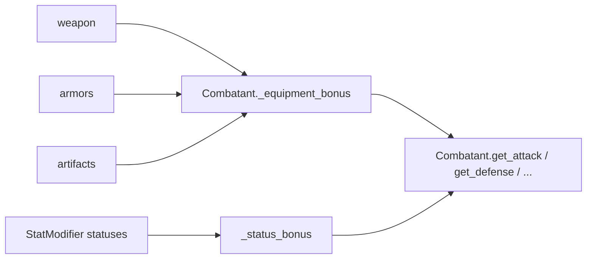

# Items & Inventory

The item model lives in `res://items/`; the party's stash lives in
`GameState.inventory` (`states/inventory.gd`). Combat's use of items is covered in
`combat.md` §8 — this doc is the model itself.

---

## 1. The item model (`items/`)

```
Item (Resource)
├── id: StringName            # stable key: stacking + saves use this
├── display_name: String
├── description: String
├── texture: Texture2D
│
├── ItemEquipable (extends Item)
│   ├── slot: Slot { WEAPON, ARMOR, ARTIFACT }
│   └── modifiers: max_health, max_mana, attack, magic, defense, speed, accuracy
│
└── Consumable (extends Item)
    ├── heal: int             # used out of combat
    ├── mana: int             # used out of combat
    └── combat_action: ItemAction   # what it does in battle
```

- **Stack by `id`, never by `display_name`.** `id` is the save/stacking key, so keep it
  stable once shipped. Localized names must not be used for identity.
- `amount` is **not** stored on the item (the old game did this and shared one count
  across all copies). Stacks live in the `Inventory`.

Authored examples: `data/items/potion.tres`, `mana_tonic.tres`, `spark_wand.tres`,
`training_sword.tres`, `leather_vest.tres`.

---

## 2. Inventory (`states/inventory.gd`)

```gdscript
class Inventory:
    var money: int

    func add(item: Item, amount := 1) -> void
    func remove(id: StringName, amount := 1) -> bool   # false if not enough
    func count(id: StringName) -> int
    func has(id: StringName) -> bool
    func get_item(id: StringName) -> Item

    func items() -> Array[Item]
    func equipables() -> Array[ItemEquipable]
    func consumables() -> Array[Consumable]

    func use_consumable(id: StringName, member: CombatantData) -> bool

    func to_dict() -> Dictionary
    func from_dict(data: Dictionary) -> void
```

- Internally it keeps `_counts: Dictionary[id -> amount]` and `_by_id: Dictionary[id -> Item]`.
- `remove` drops the id entirely when the count hits zero.
- `use_consumable` applies the item's `heal`/`mana` to a `CombatantData` and removes one.
- `to_dict` stores `{path, amount}` per stack (the resource path, so saves can reload it);
  `from_dict` `load()`s each path and re-adds it.

`GameState.inventory` is created at startup. A fresh game seeds
`data/items/potion.tres` x3 and `mana_tonic.tres` x2 from
`levels/level_manager_start.gd`.

---

## 3. Equipment

Equipment is **not** stored in the inventory once equipped — it lives on the fighter:

```gdscript
class CombatantData:
    weapon: ItemEquipable
    armors: Array[ItemEquipable]
    artifacts: Array[ItemEquipable]
```

`Combatant` folds equipment into every stat getter, so nothing that reads a stat has to
know about gear:

```gdscript
func get_attack() -> int:
    return data.attack + _equipment_bonus(&"attack_modifier") + _status_bonus(&"attack")
```

- `_equipment_bonus(prop)` sums the modifier across weapon + armors + artifacts.
- `_status_bonus(stat)` sums active `StatModifier` status effects.
- A **fresh** combatant starts on a full, equipment-aware HP/MP bar; later battles resume
  the saved HP/MP. `PartyMember.to_dict/from_dict` serialize the equipment **paths**, so
  gear survives a save.



### Open design question

`doc/Meeting.md` says *"weapons got cut, we only have armor and artefacts now"*, but the
model still has a `WEAPON` slot and the demo characters are equipped with a `spark_wand`
and a `training_sword`. Decide one way and make the model match:

- keep weapons: leave the `Slot.WEAPON` enum value and the `weapon` field as-is; or
- cut weapons: remove `Slot.WEAPON` / `CombatantData.weapon` (and the weapon paths in
  `PartyMember.to_dict`), and re-author the demo gear as armor/artifacts.

---

## 4. Items in combat

A `Consumable.combat_action` is an `ItemAction` (an `ActionBase`):

```gdscript
class ItemAction extends ActionBase:
    item_id: StringName
    heal: int
    mana: int
    # + inherited ActionBase.status
    # defaults: target_side = ALLY, uses_timing = false
```

In battle, `Arena.available_actions_for(actor)` appends one duplicated `ItemAction` per
consumable in the inventory for player-controlled members (tagged with its `item_id`), and
`Arena._apply_action()` removes one from the inventory when the action resolves. No extra
glue is needed to add a usable item — author a `Consumable` with a `combat_action` and it
shows up in the Items tab.

---

## 5. Adding an item

1. **Equipable:** author an `ItemEquipable` `.tres` (set `id`, `display_name`, `slot`,
   modifiers) and assign it to a `CombatantData.weapon/armors/artifacts`, or add it to the
   inventory for a future equip menu.
2. **Consumable:** author an `ItemAction` `.tres` (heal/mana/status), then a `Consumable`
   `.tres` pointing at it with matching out-of-combat `heal`/`mana`.
3. Give it out via `GameState.inventory.add(item, n)`, a Dialogic event, or a Beehave
   leaf.

---

## 6. Not done yet

- **No equipment/inventory UI.** Equipment is assigned on the resource; there is no equip
  screen, and nothing calls `Inventory.use_consumable` from the overworld yet.
- **Save/load** is not wired, so inventory/equipment don't persist across sessions yet
  (the `to_dict` methods are ready for it).
- **The item-derived type system** from the design notes (a fighter's type = the most
  common type across their items) is not started — it needs a design pass first.
