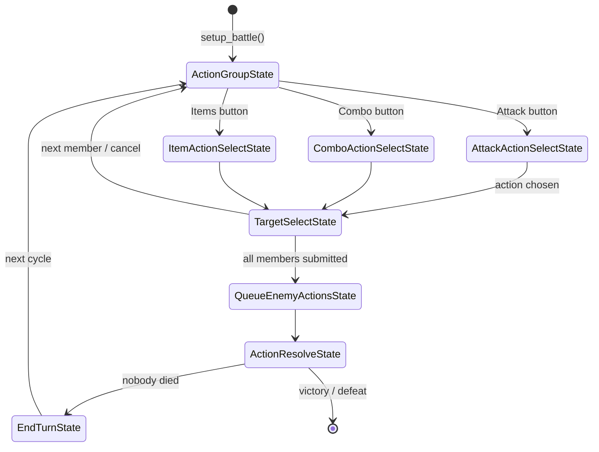
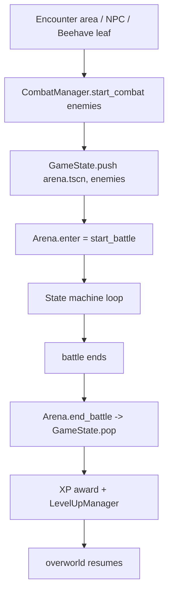

# Old-Version → Rewrite Porting Plan

Analysis of `old-version/` (Godot 4.6.3, "Neuro-sama: The Good, The Evil and The Filtered")
against the current rewrite at the repo root (Godot 4.7), and a plan for what to port,
what to redo, and how the ported parts should slot into the current systems.

> `old-version/` is a **symlink** to `~/Projekte/NeuroGEF-old-version`. Godot does not
> follow it (`.godot/global_script_class_cache.cfg` contains zero `old-version` entries),
> so it is currently NOT part of the build. Keep it that way — see Caveats.

---

## Status — what has actually been ported

Updated after the combat port. The rest of this document is the original plan (still
useful as the roadmap); §2 in particular describes the *pre-port* rewrite.

### Done

- **Combat core (Option A).** `Arena` hub + turn-loop states, `Combatant` runtime,
  and a `CombatManager` entry point that pushes `res://combat/arena.tscn` onto the
  `GameState` stack. Files: `combat/`, `autoloads/combat_manager.gd`. The arena hides
  and freezes the level underneath, parks the player, and swaps in its own camera.
- **Data model.** `CombatantData` is exported; `PartyMember`/`EnemyData` subclasses;
  actions `Attack`/`Heal`/`Combo`/`Ultimate`/`ItemAction`; `AIActionWeights`;
  `StatusEffect`. All under `combat/data/`.
- **Timing (active + relaxed).** `combat/timing/timing_grade.gd` (grades/multipliers/
  colors) and `combat/timing/timing_challenge.gd` (base + `Active` QTE + `Relaxed` roll
  + `create()`), with `combat/qte/qte_bar.tscn` (multi-section, colored by grade).
- **Enemy AI** (`combat/ai/enemy_ai.gd`), **win/lose**, **XP + ult write-back**.
- **Status-effect timing hooks**: `StatusEffect` + `Arena._tick_statuses` at
  START_OF_TURN / END_OF_TURN / END_OF_ROUND (no concrete effects yet).
- **Beehave + quest integration.** `StartCombat` leaf (in `addons/beehave_additions/`),
  victory rewards applied by `CombatManager` (a persistence key and/or a quest),
  `PersistenceGoal` quests (`quests/defeat_drones.tres`), the `EncounterArea`, and a
  `CombatNpc` lineup (`characters/ch1/combat_npc.tscn`, `levels/ch1/other/combat_demo.tscn`).
- **Overworld party.** The party walks as a line behind the leader
  (`characters/playable/party_follower.tscn`); this replaces the old `pm1`/`pm2` escorts.
- **Docs.** `doc/combat.md`.
- **Tests.** A headless suite at `tests/combat_tests.tscn` (run:
  `godot --headless --path . res://tests/combat_tests.tscn`) passes **65/65**
  (timing, QTE, combatants, actions, serialization, statuses, combo/ult gating, a
  full battle, stack suspension + camera, manager rewards, followers).

### Not done yet

- **Phase 0** assets/SFX, **Phase 5** items-in-combat, **Phase 7** save/load + menus +
  audio. `AudioManager`, `SaveManager`, the overworld HUD and the settings menu are unported.
- **Level-up UI** (XP is stored on `PartyMember`; there is no level screen) and the
  **boss ult gauge** in the HUD.
- **Concrete status effects** and the item-derived **type system** from the notes.
- **Equipment modifiers** on stats, and the old **overworld NPC component framework**
  (its *behaviour* is replaced by Beehave; only `CharacterBase.move/animate` style
  primitives would still be worth porting for cutscenes).

---

## Verdict legend

| Verdict | Meaning |
| --- | --- |
| **PORT AS-IS** | Copy the file/resource with (at most) path/UID fixes. |
| **PORT WITH ADAPTATION** | Keep the design, change APIs/names/dependencies to fit the rewrite. |
| **REWRITE** | Concept is worth keeping, but the code is tied to dead APIs or is broken; reimplement. |
| **DROP** | Obsolete or dead; do not carry over. |

---

## 1. Executive summary

- The old version has a **complete, working turn-based combat loop** with a state machine,
  QTE minigames, AI action selection, an ult gauge, equipment-modified stats and XP/level-up.
  The rewrite has only a skeleton that cannot currently start a battle. **Combat is the
  single highest-value port and the main reason for this plan.**
- Most old code is coupled to two things the rewrite deliberately dropped: **absolute node
  paths** (`$/root/Root/...` from `root.tscn`) and a set of **manager autoloads**
  (`CombatManager`, `SceneManager`, `PartyManager`, `InventoryManager`, `SaveManager`,
  `LoadManager`, `LevelUpManager`, `CutsceneManager`, `AudioManager`, `CameraManager`).
  Almost every "PORT WITH ADAPTATION" means *re-point it at the current owners*
  (`GameState`, `LevelManager`, `PlayerManager`, `GameState.party`/`inventory`/`keys`).
- The **data-heavy resources are mostly portable** (`CombatantData`, action/weight/item
  `.tres`, shaders, QTE scenes, Dialogic timelines, all art/audio). The **logic-heavy
  managers are mostly rewrite**, because the current architecture already provides better
  equivalents or the old implementations are buggy.
- Two design patterns from the old version are worth adopting wholesale because the rewrite
  already gestures at them: the **Arena hub + `ArenaStateBase` state machine**, and the
  **`CombatantData` resource + runtime `Combatant` wrapper** split (stats are static data,
  the node holds live HP/MP/blocking and equipment-adjusted `get_*()` accessors).
- The old **overworld NPC framework** (components/triggers/actions/modes) is largely
  superseded by the rewrite's **Beehave** integration. Port the *primitives* (sprite-sheet
  autos, colliders, `CharacterBase.move()/animate()` for cutscenes) and re-express the
  *behavior* (dialog/combat/quest triggers) as Beehave leaves.
- The old **save/load, level-up, menu-handler and AI code all contain real bugs** — see
  §12. Port the concepts, not the code.

---

## 2. Gap matrix: rewrite vs old

| Subsystem | Current rewrite | Old version |
| --- | --- | --- |
| Combat turn loop | Skeleton; `Setup`→`QueuePartyActions` (empty dead end) | Full state machine (`ArenaComponent` + 8 states) |
| Combat entry | None (`CombatManager` referenced but missing) | `CombatManager.start_combat()` autoload + persistent `CombatLayer` |
| Runtime combatants | `Combatant.setup()` broken (`sprite2d` null, not added to tree) | `Combatant` with HP/MP, blocking, equipment-modified stats, tweened animations |
| Actions | Empty data classes (`ActionBase`/`Attack`/`Combo`) | `CombatantAction` hierarchy with `animate()`/`get_value()`/`action_result()` |
| QTE | None | `MiniGameBase` + block/attack timing bars |
| Targeting | None | `SelectTargetIndicator` + `TargetSelectState` |
| Enemy AI | None | `QueueEnemyActionsState` + `AIActionWeights` |
| Ult gauge | Fields only (`party_ult_charge`) | Wired: rewards, cost, accessibility, UI display |
| Items/equipment | `Inventory` empty stub | `Item`/`ItemEquipable`/weapon/armor/artifact/consumable + manager |
| Party | `Party`/`PartyMember` + serialization | `PartyManager` (combat + overworld arrays) |
| Save/load | None | `SaveManager`/`LoadManager` JSON slots (buggy) |
| Level-up | None | `LevelUpManager` + `LevelUpUI` (buggy) |
| Overworld NPCs | Beehave + Dialogic per-NPC scripts | Component framework (templates/triggers/actions/modes) |
| Scene flow | `GameState` state stack + `LevelManager` | `SceneManager` + persistent `CurrentScene` |
| Menus | `ui/ui_scenes/*` basics | Focus-tree menu handlers (hbox/vbox/grid/scroll) |
| Audio | `default_bus_layout.tres` only | `AudioManager` with music modes |
| i18n | `.translation` resources | CSV (`i18n/de.csv`, `en.csv`) |

---

## 3. Combat architecture in the old version (reference)

Entry and ownership:

- `old-version/autoloads/combat_manager.gd` — pauses the tree, plays a transition, shows
  the persistent `CombatLayer`, calls `ArenaComponent.setup_battle(enemies)`, connects
  `battle_ended`, then on battle end hides the layer, awards XP, runs level-ups, unpauses.
- `old-version/combat/arena.gd` — `Arena` node: ult-charge state (`party_ult_charge`,
  `boss_ult_charge`, clamped setters, `change_ult_charge`, `reset_ult_charges`).
- `old-version/components/arena/arena_component.gd` — **the hub**. Owns `party`/`enemies`
  (`Array[Combatant]`), `action_queue`, `player_actions_submitted`, and the API:
  `setup_battle`, `submit_action[_player]`, `check_player_turn_over`, `reset_turn_state`,
  `start_over`, `_has_battle_ended`, `_save_party_stats`, `_award_xp`, `cleanup_battle`,
  `end_battle`, `spawn_combatants`, `wait_for_target_selection`, `get_alive_*`,
  `get_current_combatant`. Signals: `battle_ended`, `cycle_started`.
- `old-version/components/arena/arena_state_base.gd` — `ArenaStateBase` with `enter()/exit()`,
  `@onready parent: ArenaComponent` and `arena: Arena`.

Turn loop (the state machine is a graph wired through exported `NodePath`s; `get_states()`
collects children):



Details worth preserving:

- **Player phase**: `ActionGroupState.enter()` re-emits `cycle_started`; the UI manager
  rebuilds each character's action menu and focuses it. `ActionSelectState` (subclassed per
  category) filters the current combatant's `attack_actions` by `is_accessible()` (mana),
  and for ults by `is_accessible_ult()` (gauge full) / combos by `is_accessible_combo()`.
- **Targeting**: `TargetSelectState` awaits `SelectTargetIndicator.wait_for_target_selection()`
  (cycle targets with up/down, accept to confirm, cancel to go back), then
  `submit_action_player()`.
- **Enemy phase**: `QueueEnemyActionsState.pick_action()` scores `BasicAttackAction`
  targets by "vulnerable now?" and `BasicHealAction` by "wounded enemies?", then
  `pick_target()` does a weighted random pick using `AIActionWeights`.
- **Resolution**: `ActionResolveState` sorts `action_queue` by `source.get_speed()` desc,
  executes attacks (redirecting onto a random living foe if the target died),
  applies `BLOCK`, and checks `_has_battle_ended()` after each action.
- **Actions** (`resources/actions/*`): `CombatantAction` base has `type`, `mana_cost`,
  `ai_weights`, `source`/`target`, `qte_multiplier`, and three overridable hooks:
  `animate()` (tween to target, run minigame, tween back), `get_value()` (raw power) and
  `action_result()` (apply mana cost, damage/heal, ult reward).
- **Damage/blocking** (`old combat/combatant.gd`): `take_damage()` subtracts
  `get_defense()` (doubled while blocking), clamps at 0, plays `dead`, returns blocked amount.
  Equipment modifiers are folded into `get_attack/get_defense/get_speed/get_magic/get_accuracy/get_max_health/get_max_mana`.
- **Ult gauge**: `change_ult_charge` is injected as a `Callable`; attacks reward charge,
  ults spend it; `UltDisplayHandler` renders party/boss gauges.
- **Persistence of results**: `_save_party_stats()` writes HP/MP back to each
  `CombatantData` resource; `_award_xp()` adds the sum of enemy `xp` to every party member.

---

## 4. What to port: assets, shaders, resources (safe first wave)

| Item | Verdict | Notes |
| --- | --- | --- |
| `old-version/assets/**` (sprites, bgm, sfx, tilesets, masks) | PORT AS-IS | Big win: battle sprites (`neuro_battle`, `evil_default`, `drone_default`), battle SFX, and the BGM library. Merge into `assets/`, dedupe with what the rewrite already has (`neuro.png`, `evil.png`, `nere.png`, `tree_*.png`), and re-run the import. |
| `old-version/shaders/combatant_shader.gdshader` | PORT AS-IS | Used for hit-whiteout/`toggle_off`; current `Combatant` has no shader yet. |
| `old-version/data/combatants/*.tres`, `data/actions/*.tres`, `data/weights/*.tres`, `data/items/*.tres` | PORT WITH ADAPTATION | Good balance reference data (enemy/player stats, basic/strong/ult/combo actions, weights). Script paths/UIDs and field names change (see §5), so re-author against the new scripts. |
| `old-version/resources/weights/ai_action_weights.gd` | PORT AS-IS | Tiny, generic scoring-weights resource; feed the new AI. |
| `old-version/combat/*minigame*.tscn` + `block_minigame.gd` / `generic_attack_minigame.gd` | PORT WITH ADAPTATION | Timing-bar QTE is small and self-contained; adapt input to the current input map and clean the multiplier hack (see §7). |
| `old-version/combat/basic_qte_animation.tres` | PORT AS-IS | AnimationLibrary used by both minigames. |
| `old-version/dialogue/*.dtl`, `old-version/characters/*.dch` | PORT WITH ADAPTATION | Same Dialogic addon; verify against the rewrite's Dialogic version and re-point character/timeline paths in `project.godot` `[dialogic]` + `[dialogic] directories`. |
| Old custom Dialogic events referenced by `old-version/docs/CUTSCENES.md` (`await`, `ToggleMode`) | REWRITE | The rewrite already has its own Dialogic additions (`PersistenceKeys`, `Quest`); reimplement needed cutscene events on top of those. |

---

## 5. Combat data model (reconcile, don't copy)

The two `CombatantData` classes are **not** identical, and the difference drives most of the
adaptation work.

| Concept | Old (`old-version/resources/combatants/combatant_data.gd`) | Current (`combat/data/combatant_data.gd`) |
| --- | --- | --- |
| Exports | Fully `@export`ed (authorable in inspector) | Plain `var` (not authorable) |
| Stat names | `base_attack`, `base_defense`, `base_speed`, `base_magic`, `base_accuracy` | `attack`, `magic`, `defense`, `speed`, `accuracy` |
| Level/XP | On `CombatantData` | On subclass `PartyMember` |
| Growth | `*_increase_by_level` fields + `set_stats_for_level()` | none |
| Actions | `attack_actions: Array[CombatantAction]` | `attacks: Array[Attack]` (empty stub) |
| Equipment | `weapon`, `armors`, `artifacts` | none |
| Party vs enemy | one class | `PartyMember` / `EnemyData` subclasses |

**Recommendation:** keep the current split (`CombatantData` base + `PartyMember`/`EnemyData`)
because it is cleaner, but:

1. Make every `CombatantData` field `@export` so enemy/party `.tres` become authorable.
2. Port `level`/`xp` to `PartyMember` (already there) and `is_boss`/`xp_reward` to `EnemyData`
   (already there).
3. Add equipment (`weapon`, `armors`, `artifacts`) and the ported `Attack` hierarchy
   (`Attack`/`Combo`/item/ult) as exports.
4. Port the runtime `Combatant` accessor pattern (`get_attack()` etc. that sum equipment
   modifiers) instead of the raw `attack` field, so equipment works without breaking the
   serialized stat shape.
5. Keep current field names (`attack`, not `base_attack`) so `PartyMember.to_dict/from_dict`
   and existing saves stay valid; map old `.tres` values in when re-authoring.

`Attack` should grow the old hooks: `animate()`, `get_value()`, `action_result()`, `type`,
`mana_cost`, `ai_weights`, plus `source`/`target` runtime fields.

---

## 6. Two ways to integrate combat — recommend option A

**Option A — Arena as a `GameState` pushed state (recommended).**
Make `Arena` a normal scene entered through the existing stack:

```
CombatManager.start_combat(enemies)
  -> GameState.push("res://combat/arena.tscn", enemies, true, "res://transitions/fade_transition.tscn")
  -> Arena.enter(enemies)  ==  start_battle(enemies)
  ... state machine runs ...
  Arena.end_battle(result)  ->  GameState.pop(result)
```

- Reuse the rewrite's transitions (`BaseTransition`/`fade_transition`) and the stack's
  process/input suspension of the underlying level — no `get_tree().paused` juggling, no
  absolute `$/root/Root/CombatLayer` paths.
- Keep a thin **`CombatManager` autoload** as the entry point so callers (encounter areas,
  Beehave leaves, Dialogic) don't need to know the arena scene path, and so music/level-up
  choreography has one home.
- `render_underlying = true` keeps the overworld visible under the battle background.

**Option B — port the persistent `CombatLayer` + pause model.** Higher fidelity to the old
game and keeps the overworld tree alive, but reintroduces tree-pausing and absolute paths.
Only choose this if a battle must visually sit over the live level.



**Hub placement:** the old design splits `Arena` (ult state) from `ArenaComponent` (turn
hub). The rewrite's `Arena` is already the hub that `ArenaStateBase.arena = get_parent()`
targets. Recommendation: **fold `ArenaComponent`'s responsibilities into the current
`Arena`** (or nest an `ArenaComponent` child and keep `ArenaStateBase.get_parent()` pointing
at it — pick one and be consistent). Folding is simpler and matches the current
`Setup`/`QueuePartyActions` child-state pattern.

---

## 7. QTE minigames

`MiniGameBase` (`old-version/components/arena/minigame_base.gd`) emits
`minigame_completed(success, value)`; `block_minigame.gd` and `generic_attack_minigame.gd`
are near-identical timing bars:

- `do_minigame(action)`: connect completion → handler, play `"play"` animation (indicator
  sweeps), and if the player never responds, complete as failure.
- On accept: check indicator against weak/strong success rects; strong → value `2`,
  weak → value `1`, else `0`.
- Block handler: on success `target.set_blocking(true)` and **temporarily** divide
  `action.qte_multiplier /= value` around `action_result()`, then multiply back.
- Attack handler: multiply `action.qte_multiplier *= value`, `action_result()`, then divide back.

**Verdict: PORT WITH ADAPTATION.** The timing-bar concept and scene layout are reusable, but:

- Replace the `qte_multiplier` mutate/restore dance with an explicit
  `action_result(success: bool, value: int)` parameter (clearer and re-entrant).
- Adapt input to the current action map (`interact`/`dialogic_default_action`) instead of
  the old `ui_accept`.
- Both minigames duplicate the same branch logic — factor a shared `TimingBarMinigame` base.

---

## 8. Party, inventory, items, equipment

| Old file | Verdict | Target |
| --- | --- | --- |
| `autoloads/party_manager.gd` | REWRITE | `GameState.party` already holds `Party`/`PartyMember`; add `add_member/remove_member` methods to `Party` (matches the project rule of not mutating containers directly). |
| `autoloads/inventory_manager.gd` | PORT WITH ADAPTATION | Fill the empty `states/inventory.gd` (`class_name Inventory`): typed stacks + `money` + `perform_transaction(item, type, money)`; **stack by resource path/id, not localized `display_name`**. |
| `resources/items/item.gd`, `equipable.gd`, `weapon.gd`, `armor.gd`, `artifact.gd`, `consumable.gd`, `collectable.gd` | PORT WITH ADAPTATION | Keep the model; fix the `ItemWepon` typo; make `amount` non-shared (see §12); give each `to_dict/from_dict`. |
| `data/items/test.tres` | PORT WITH ADAPTATION | Re-author against the new scripts. |
| `resources/actions/*item*` + `CombatantItemAction` | PORT WITH ADAPTATION | Consumables-in-combat is a `Meeting.md` goal; hook into the new `Attack`/item action and `GameState.inventory`. |

Equipment integration point: equipped `weapon`/`armors`/`artifacts` live on the party
member's data and are read by `Combatant.get_*()`. `PartyMember.to_dict/from_dict` currently
serializes stats but **no equipment** — extend it (or key equipment off `Inventory`) when
porting, or equipment is lost on save.

---

## 9. Save/load

Old: `SaveManager` (3 slots at `user://save_slot_N.json`) delegating to `LoadManager`
(conflated serialize + deserialize, absolute node paths, and several crashes — §12).
Nothing exists in the rewrite.

**Verdict: REWRITE, borrowing the shape.** Recommended design:

- One `SaveManager` autoload; JSON slots (`user://save_slot_N.json`) **plus a `version`
  field** (old had none) and a timestamp.
- Serialize by walking the owners that already exist:
  `GameState.party.to_dict()`, `GameState.inventory.to_dict()`, `GameState.keys.get_all()`,
  current scene path + `PlayerManager.get_player_position()` + facing.
- Deserialize by calling the same `from_dict`/`load_from_dict` methods in reverse, then
  `LevelManager.change_level(scene, spawn_id)`.
- Do **not** port `LoadManager`'s per-category helpers or its `stack.item.*` access (bug).

---

## 10. Overworld NPCs & cutscenes

The old framework (documented in `old-version/docs/NPCS.md`) is a component model:
**Template → Autos + Triggers (→ Actions) + Modes**. The rewrite already replaced the
*behavioral* half with **Beehave** + Dialogic. Split the port accordingly:

**Port the primitives (PORT AS-IS / small adaptation):**

- `components/npcs/autos/8x2_sprite_sheet.gd`, `walking_animatied_sprite.gd`,
  `foot_collider.gd`, `tile_collider.gd`, `body_area.gd`, `body_collider.gd` — pure
  `_set_defaults()` configuration nodes with no engine coupling.
- `components/characters/character_base.gd` — `move()`/`animate()` with
  `done_moving`/`done_animation` signals. This is the cutscene-facing API; keep it (adapt to
  the current `AnimationTree`-based player and drop the `CutsceneManager` coupling).
- `components/shared/interactable.gd` — Area2D interaction; prefer its
  `is_in_group("player")` check over the rewrite's `body.name == "Player"`.

**Re-express as Beehave leaves (PORT WITH ADAPTATION → REWRITE the wiring):**

- Old `trigger_base.gd` is an ordered `Action` runner with `wait` semantics — that is
  exactly a Beehave `Sequence`.
- `triggers/immediately.gd`, `close.gd`, `dialogic_signal.gd`, `ui/interact.gd` →
  `EnteredArea` / `Interacted` leaves (the rewrite's `addons/beehave_additions/` already
  has an area/interact pattern; unify it).
- `actions/dialog.gd` → the existing `StartTimeline` leaf + a `PersistenceKeys` gate so
  `immediately` triggers don't re-fire on every load (a bug in the old `iceboi45.tscn`).
- `actions/combat.gd` → `CombatManager.start_combat(GameState.party-ish enemies)` (ties into
  §6).
- Quests: old NPCs had **no** quest action; use the rewrite's `AddQuest` leaf.

**DROP / REWRITE:**

- `modes/loop.gd`, `modes/follow.gd`, `actions/toggle_mode.gd` — superseded by Beehave;
  `follow.gd` is also buggy.
- `actions/transaction.gd` — mutates the shared `Item.amount` resource (state leak); rebuild
  on the new inventory.
- `characters/evil.gd`, `vedal.gd` — dead (their scenes use template scripts, not these).
- `components/npcs/templates/chest.gd` — used in 0 scenes and TileMap-coupled.

Cutscene choreography: old `CutsceneManager` (`start_cutscene`, `get_character_node`,
`move`, `animate`, `move_cam_to/by`) is a thin Dialogic bridge. Reimplement the parts you
need as a small helper + `CharacterBase` methods; there is no current equivalent. To lock
the player during dialogue, mirror the old behavior via `PlayerManager.set_player_active(false/true)`
on `Dialogic.timeline_started/ended` (the old player did exactly this).

---

## 11. UI, menus, level-up, audio, i18n

| Old file | Verdict | Target / notes |
| --- | --- | --- |
| `components/ui/menu_element.gd` | PORT AS-IS | Generic focus-aware `Button` with `text_key`/`data` + `tr()`. |
| `components/ui/hbox_menu_handler.gd`, `vbox_menu_handler.gd` | PORT AS-IS | Pure focus-neighbor logic. |
| `components/ui/menu_handler.gd` | PORT WITH ADAPTATION | Fix the focus-changed guard (dead body) and integrate with `GameState.push`. |
| `components/ui/grid_menu_handler.gd`, `scroll_grid_menu_handler.gd` | PORT WITH ADAPTATION | Fix unbounded neighbour recursion / typos; keep the scroll behavior for action lists. |
| `components/ui/save_menu_handler.gd` | REWRITE | Hardwired to old managers + hardcoded new-game payload; rebuild on the new `SaveManager` (§9) and `GameState.push`. |
| `components/ui/ui_input_component.gd` (+ `shared/input_component.gd`) | REWRITE | Old code uses built-in `ui_*` actions which the rewrite rebound to WASD; either re-add `ui_*` aliases or make handlers read `move_*`/`interact`/`ui_cancel`. |
| `components/ui/transition.gd`, `scene_transition*.gd`, `transition.tscn` | DROP | Superseded by `BaseTransition`/`fade_transition.tscn` and `LevelManager.change_level` + `SpawnPoint`. (Note: `transition.gd` and `transition.tscn` name-collide with different purposes — porting the wrong one is easy.) |
| `ui/main_overworld_ui.gd/.tscn`, `pm_main_ui_stat_display.gd/.tscn` | PORT WITH ADAPTATION | Reusable HUD/stat layout; fix the per-frame `ImageTexture` rebuild and stale party snapshot. |
| `autoloads/level_up_manager.gd` | REWRITE | Keep the signal-driven idea + `xp_requirement = 5 * 2**level`, but the stat application is wrong (§12) and the stat model changed. |
| `ui/level_up_ui.gd/.tscn` | REWRITE | Data-model mismatch, untranslated strings, `$/root/...` coupling; rebuild on `GameState.party` + the ported menu handlers, pushed with `render_underlying = true`. |
| `autoloads/audio_manager.gd` | PORT WITH ADAPTATION | Music modes + bus-volume logic is worth keeping; no current audio autoload, and bus names differ (`BGM`/`SFX` vs old `Music`/`SFX`). |
| `autoloads/camera_manager.gd` | PORT WITH ADAPTATION / DROP | Follow/move tween API reusable, but it wraps PhantomCamera (not in the rewrite). Decide whether the rewrite wants a camera manager at all. |
| `i18n/de.csv`, `i18n/en.csv` | PORT WITH ADAPTATION | Merge keys (`menu_*`, `combat_btn_*`) into `localization/de.de.translation`/`en.en.translation`. Note old `combat_btn_*` exists only in `en.csv`. |

Menu integration rule: menus should be **states**, not sibling `visible` toggles (the old
code hid/shown siblings). Push with `GameState.push(path, args, true, "res://transitions/fade_transition.tscn")`.

---

## 12. Do NOT port (bugs / dead / hacky)

**Combat**

- `QueueEnemyActionsState.pick_action()` indexes `enemy_actions` with a *target* index
  (`enemy_actions[temp_int]`) and can return `null` → `submit_action(null)`; heal targeting
  is only a `print`. **Redo the AI.**
- `ActionResolveState` redirects a dead target onto a *uniformly random* living foe
  (`pick_random`) while `pick_target` does weighted selection — inconsistent; unify.
- QTE multiplier is applied by mutating `qte_multiplier` and restoring it around
  `action_result()` — fragile; pass the value explicitly (§7).
- `Combatant.take_damage()` returns `amount - effective_damage` (the *blocked* amount) but
  the return value is fed to `reward_ult_charge` as `blocked_damage` — works only by
  coincidence of naming; clarify the contract.
- `_save_party_stats()` uses integer division and revives KO'd members at half HP
  (`get_max_health() / 2`) — confirm this is intended.
- `SelectTargetIndicator` polls in a `while` loop with `create_timer(0)` — redo with input
  events.
- `BlockMinigame`/`GenericAttackMinigame` are copy-paste duplicates — factor out.

**Current-version bugs to fix while porting** (not from old, but they block combat):

- `combat/states/setup.gd` loops `range(size - 1)` (skips last combatant) and never
  `add_child`s the instantiated combatants.
- `combat/combatant.gd` `@onready var sprite2d: Sprite2D` has no initializer (null).
- `levels/ch1/starting_area/combat_test_remove_later.gd` calls a missing `CombatManager`
  and preloads a missing `res://data/combatants/enemy_base.tres`; it is orphaned (no scene
  uses it). Delete it once a real encounter path exists.
- `combat/arena.tscn` is never instantiated anywhere.

**NPC/overworld**

- `templates/template_base.gd toggle_mode()` logic is inverted.
- `actions/animate.gd` sets `wait = true` and awaits `done_animation`, but `animate(...,
  is_loop = true)` never emits it → deadlock.
- `modes/follow.gd` never clears `points` on deactivate; `dont_move()` uses a string-slice
  hack; exported as a script type.
- `characters/drone.gd` never zeroes `velocity` in the deadzone (drifts).
- `actions/transaction.gd` mutates shared `Item.amount`.
- `shared/input_component.gd get_just_pressed_vector_input()` uses `is_action_pressed` on
  the event path.
- `templates/template_base.gd setup()` scans parent children for a `LevelAudioData` sibling.
- `immediately` triggers re-fire every scene load (no persistence gate).

**UI / managers**

- `menu_handler.gd::_on_gui_focus_changed` guards against `get_children()` (its own
  children), so the body is dead.
- `grid_menu_handler.gd` neighbour lookups recurse without a base case → stack overflow.
- `save_menu_handler.gd` stale `text_key` labels, slot off-by-one, hardcoded new-game
  payload.
- `pm_main_ui_stat_display.gd` rebuilds an `ImageTexture` every frame.
- `level_up_manager.gd::_increase_stats()` adds `max_health_increase` to `base_attack` and
  `magic_increase` to a non-existent `base_magic_increase_by_level`.
- `load_manager.gd serialize_*` reads `stack.item.*` (inventory holds items directly →
  crash), `load_*` all append to `weapons`, `load_artifacts` builds `ItemArmor`; `"wepons"`
  typo.
- `party_manager.gd` sets `character.owner = get_tree().edited_scene_root` (editor-only).
- `scene_manager.gd` clears its transition registry then indexes the target after a
  deferred `add_child` (race).
- `audio_manager.gd play_sfx` indexes `overworld_party[1]/[2]` without bounds checks.
- `project.godot [audio]` points at `res://resources/default_bus_layout.tres`, which does
  not exist (dead config).

---

## 13. Old → new mapping (integration contract)

| Old | New |
| --- | --- |
| `CombatManager` (`$/root/Root/CombatLayer`) | `CombatManager` autoload → `GameState.push(arena.tscn)` |
| `Arena` + `ArenaComponent` | `Arena` hub + `ArenaStateBase` child states |
| `Combatant` runtime wrapper | `combat/combatant.gd` (fill in) |
| `CombatantData` | `CombatantData` + `PartyMember`/`EnemyData` (make `@export`) |
| `CombatantAction` + subclasses | `ActionBase`/`Attack`/`Combo` + behavior hooks |
| `AIActionWeights` | same resource, new AI consumer |
| `PartyManager.combat_party` | `GameState.party.members` |
| `InventoryManager` | `GameState.inventory` (fill `states/inventory.gd`) |
| `SaveManager`/`LoadManager` | new `SaveManager` over `GameState` + `Party.to_dict` |
| `SceneManager`/`CurrentScene` | `GameState` stack + `LevelManager` |
| `CutsceneManager` | small Dialogic helper + `CharacterBase.move/animate` |
| `AudioManager` | new `AudioManager` on `BGM`/`SFX` buses |
| `CameraManager` (PhantomCamera) | new camera manager (or omit) |
| `LevelUpManager` + `LevelUpUI` | rebuilt on `GameState.party` + ported menu handlers |
| Menu handlers | `MenuHandler`/`MenuElement` + `GameState.push` |
| NPC component framework | Beehave leaves + ported autos/`CharacterBase` |
| `ui_*` input aliases | current `move_*`/`interact`/`ui_cancel` (or re-add aliases) |
| CSV i18n | `.translation` resources |

---

## 14. Recommended port order (phased, with dependencies)

1. **Phase 0 — Assets & resources.** Merge `assets/**`, shaders, QTE scenes/animation,
   Dialogic timelines/characters, i18n keys. No code coupling; unblocks visuals/audio.
2. **Phase 1 — Data model & serialization.** Expand `CombatantData`/`Attack`/items/equipment,
   make fields `@export`, extend `PartyMember.to_dict/from_dict` for equipment, fill
   `Inventory`. *(Depends on 0 for `.tres` re-authoring.)*
3. **Phase 2 — Combat core.** Port `Combatant` runtime behavior; fold `ArenaComponent` into
   `Arena`; port `ArenaStateBase` + `ActionGroupState`/`ActionSelectState`/`TargetSelectState`/
   `QueueEnemyActionsState`/`ActionResolveState`/`EndTurnState`; add the `CombatManager` entry
   via `GameState.push`. Fix the current `setup.gd`/`combatant.gd` bugs. *(Depends on 1.)*
4. **Phase 3 — Actions, targeting, QTE.** Port `CombatantAction` hierarchy behavior +
   `SelectTargetIndicator` + the timing-bar minigames + ult gauge. *(Depends on 2.)*
5. **Phase 4 — AI, win/lose, XP, level-up.** Rewrite enemy AI on `AIActionWeights`; port
   `_has_battle_ended`/`_award_xp`; rebuild `LevelUpManager` + UI. *(Depends on 3.)*
6. **Phase 5 — Items/consumables in combat.** Wire `ItemActionSelectState` to the new
   inventory. *(Depends on 1 & 3.)*
7. **Phase 6 — Overworld integration.** Port NPC autos + `CharacterBase`; expose the combat
   entry as a Beehave leaf / encounter area; add persistence gates to triggers. *(Depends on 2 & 4.)*
8. **Phase 7 — Save/load, menus, audio settings.** New `SaveManager`, rebuild the save menu +
   overworld HUD, add `AudioManager`. *(Depends on 1, 5, 7.)*

---

## 15. Caveats

- **Symlink / scan safety.** `old-version/` must stay outside Godot's scan. It currently is
  (0 refs in the class cache). If you copy files in, watch for `class_name` collisions —
  `Arena`, `Combatant`, `CombatantData`, `Item`, `CombatantAction`, `ArenaStateBase`,
  `MenuHandler`, `MiniGameBase`, etc. all exist in both trees. Prefer copy-and-adapt over
  referencing.
- **Export filter.** `export_presets.cfg` uses `export_filter="all_resources"` with empty
  excludes. If `old-version` ever becomes reachable under `res://`, add an exclude filter.
- **Engine/addon versions.** Old is 4.6.3, rewrite is 4.7; Dialogic and Beehave versions may
  differ. Verify timelines/characters and any custom Dialogic events after porting.
- **Input map.** The rewrite rebound movement to `move_*` and left built-in `ui_*` mostly
  unused, so old UI/`InputComponent` code will not navigate without adaptation.
- **Stat naming.** Decide once whether to keep the rewrite's `attack`/`magic`/... names
  (recommended, keeps saves valid) or reintroduce `base_*`; do not mix.
- **Multi-character overworld party.** The old game had `overworld_party[1]/[2]` (pm1/pm2)
  with follow logic and cutscene references; the rewrite's `PlayerManager` manages a single
  player. Whether the rewrite wants escorts is unstated — assume no until decided.
