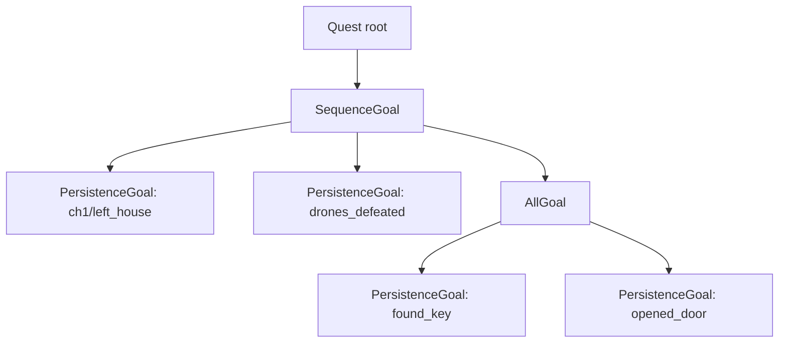
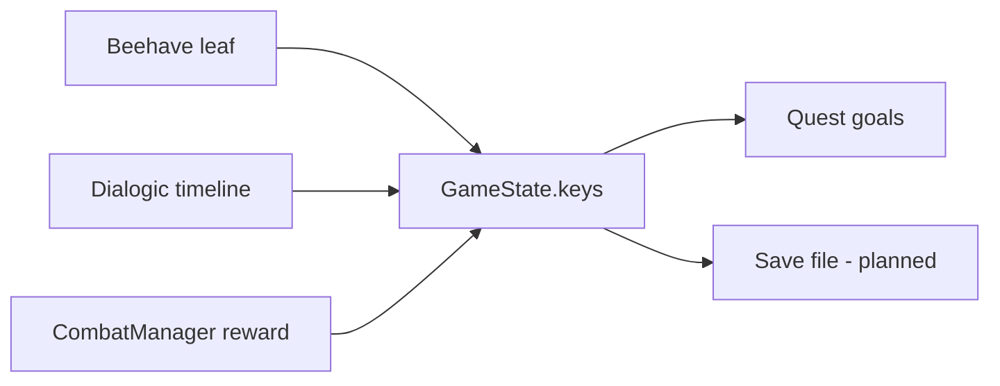

# Quests & Persistence

The game has one source of truth for progress: **persistence keys**. Quests are just a
friendly view over those keys, and both behaviour trees and dialogue read and write the
same store.

---

## 1. Persistence keys (`states/persistence_keys.gd`)

`GameState.keys` is a `PersistenceKeys` holding a `Dictionary[String, Variant]`. Anything
that must be remembered outside a single scene belongs here: story flags, opened chests,
"talked to X", collect counters.

```gdscript
GameState.keys.set_value("drones_defeated", true)
GameState.keys.increment("cats_found")                 # counters
GameState.keys.at_least("cats_found", 3)               # "collected 3" check
GameState.keys.is_true("met_ved")
GameState.keys.keys_with_prefix("ch1/")
```

### API

| Group | Methods |
| --- | --- |
| Write | `set_value(key, value = true)`, `increment(key, amount = 1)`, `erase(key)`, `clear()` |
| Read | `has`, `get_value`, `value` (alias), `is_true`, `get_number`, `get_string`, `equals`, `at_least` |
| Bulk | `get_all()`, `keys_with_prefix(prefix)`, `load_from_dict(data, replace = true)` |
| Signals | `key_changed(key, new_value, old_value)`, `key_erased(key)` |

Notes:

- `set_value` is a no-op (no signal) if the value is unchanged, so `key_changed` only
  fires on real changes.
- `is_true` treats a missing key, `0`, `""`, `null` and `false` as false — safe on any key.
- Values can be any type; booleans and integers are the common cases.

---

## 2. Quests

Quests are `Resource`s under `res://quests/`. `GameState.quests` is a `QuestManager` keyed
by id.

```gdscript
class Quest:
    id: String
    name: String
    type: String            # "main", "side", ... (free-form)
    description: String
    root: QuestNode         # the goal tree
```

### Goal tree

A quest's `root` is a tree of `QuestNode`s. Every node answers the same two questions, so
callers never need to know the node type:

```gdscript
func is_completed() -> bool
func progress() -> float    # 0.0 .. 1.0
```

| Node | File | Completes when | Progress |
| --- | --- | --- | --- |
| `PersistenceGoal` | `states/quests/persistence_goal.gd` | key exists and equals `expected_value` | 1 or 0 |
| `AllGoal` | `states/quests/all_goal.gd` | **all** children complete | average of children |
| `AnyGoal` | `states/quests/any_goal.gd` | **any** child completes | max of children |
| `SequenceGoal` | `states/quests/sequence_goal.gd` | all children complete | fraction complete; also `get_current_child()` |



`PersistenceGoal` is the workhorse: most goals are "this key is true" (or a counter
reaching a number, via a custom `expected_value`). The composite nodes are for grouping.

### QuestManager

```gdscript
GameState.quests.add_quest(quest)
GameState.quests.get_quest("defeat_drones")
GameState.quests.is_completed("defeat_drones")
GameState.quests.get_quests()          # Dictionary[String, Quest]
```

### Example

`quests/defeat_drones.tres` — one `PersistenceGoal` on `drones_defeated`. The `StartCombat`
on the Evil NPC is configured with `victory_key = "drones_defeated"`, so winning the fight
sets the key and the quest completes as a side effect.

---

## 3. Behaviour trees (Beehave)

NPC behaviour is authored as Beehave trees. The project adds leaves under
`addons/beehave_additions/`:

| Leaf | Type | What it does |
| --- | --- | --- |
| `Interacted` | `ConditionLeaf` | SUCCESS while `interact` is just-pressed and the player is inside its `area` |
| `EnteredArea` (in `enters_area.gd`) | `ConditionLeaf` | SUCCESS once when the player enters its `area`; resets on exit |
| `StartCombat` | `ActionLeaf` | starts a battle; RUNNING while one is up, SUCCESS after |
| `StartTimeline` | `ActionLeaf` | starts a Dialogic `timeline` (optionally guarded by a `key`) |
| `AddQuest` | `ActionLeaf` | `GameState.quests.add_quest(quest)` |
| `HideNode` | `ActionLeaf` | hides a node and disables a `TileMapLayer`'s collision |

A typical NPC tree, from `characters/ch1/evil.tscn`:

```
SequenceComposite
├── Interacted        (player is close and pressed interact)
├── AddQuest          (start the quest)
├── StartTimeline     (play the dialogue)
└── StartCombat       (fight; awards victory_key + quest)
```

`StartCombat` exports `enemies: Array[EnemyData]`, `victory_key: String`, `quest: Quest`.
Rewards are applied by `CombatManager.finish()`, **not** by the leaf, so they don't depend
on the tree being ticked at the right moment.

---

## 4. Dialogue (Dialogic)

Two Dialogic subsystems bridge into the game state, under
`addons/dialogic_additions/`. They are *forwarders* — the data stays in `GameState`.

- **Keys** (`PersistenceKeys/subsystem_keys.gd`) — read/write `GameState.keys` from a
  timeline. It hooks the storage's signals so anything inside Dialogic hears changes.
- **Quests** (`Quest/subsystem_quests.gd`) — start/inspect quests, and re-scan for
  completions on every key change. Emits `quest_started` / `quest_completed`.

Timeline syntax (from the subsystem docs):

```
[quest quest="res://quests/find_cat.tres"]

[key name="talked_to_ved"]
[key name="cats_found" op="add" amount="1"]

[if_key name="cats_found" is=">=" number="3"]
    Neuro: That's all of them.
[/if_key]

[if_quest quest="find_cat" is="complete"]
    Neuro: Found it!
[/if_quest]
```

Events live in `addons/dialogic_additions/`: `event_key`, `event_if_key`, `event_quest`,
`event_if_quest`. Because they come from an extension, accessor names like `Dialogic.Keys`
only exist after regenerating subsystem access in Dialogic's settings;
`Dialogic.get_subsystem("Keys")` always works.

---

## 5. The contract

Whichever way progress happens, it goes through a key:



So "advance a quest" almost always means "set/increment a key". That keeps dialogue,
behaviour trees, combat rewards and (future) saving all consistent, and makes quests
trivially serializable.

### Naming

Keys have no enforced scheme, but prefixing by chapter/area (`ch1/`, `town/`) works well
with `keys_with_prefix`. Existing examples: `drones_defeated`, `ved_ai_1`.

---

## 6. Adding a quest

1. Author a goal tree of `QuestNode`s (start with a `PersistenceGoal`; nest
   `All/Any/SequenceGoal` as needed).
2. Create a `Quest` `.tres` under `quests/`, set `id`/`name`/`type`/`description`, and
   assign the root.
3. Start it from a Beehave `AddQuest` leaf, a Dialogic `[quest]` event, or
   `CombatManager.start_combat(..., quest = ...)`.
4. Drive it by setting the keys its goals read.
