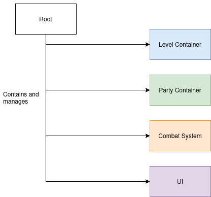
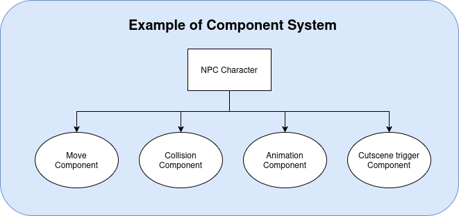
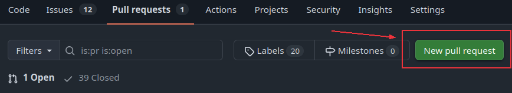
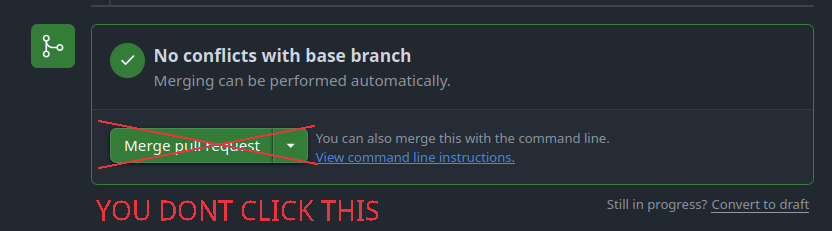

# CONTRIBUTION

In this document will be explained architecture of the project, ideas and practices used/recommended to use, workflow of contribution process and other

### Table of Contents:
1. [Architecture](#Architecture)
2. [Components Design Pattern](#Components-Design-Pattern)
3. [How to start developing](#How-to-start-developing)
4. [Workflow](#Workflow)
	* [Troubleshooting: Merge Conflicts](#merge-conflicts)


## Architecture

The first thing to tell about is that we in this project have main root scene where all game thing is happening.



This practice provide convenient management and organization for scenes and various game components.

Root node orchestrates its components transferring data between them but those components don't interact with eachother.

## Components Design Pattern

Godot encourages making and using Components System. It's a design pattern where you break down a complex system into small components fulfilling its own role.

This approach is the Godot way of following [SOLID](https://en.wikipedia.org/wiki/SOLID) principles so if you are not familiar with it is recommended to check out.

<strong>How does this approach differ from OOP (Object Oriented Programming)?</strong> Most important thing is that you don't often use inheritence. It's not prohibited to use though and it's not a bad practice. To explain it better let me give an example: while for OOP _car is transport_, for Component System _car __moves__, __rotates__, __store__ and __uses fuel__, __contains baggage__ and etc_.



It's hard to come up with such system at the start so you don't need to maniacally make everything in small components, it's mostly needed to maintain clean, understandable and reusable code. 

#### Here is tips on where you <strong>100% need</strong> to breakdown your code into components:

* Your original script is monolith that handles all processes and has 200+ lines of spaghetti-code
* Code can be reused in many other parts of the codebase. It's very important to handle same processes in the same way everywhere
* Your code is unreadable/unorganized/it's hard to follow. That most likely means it can be reorganized into divided parts that'd be easier to understand


## How to start developing

To start work you need [git](https://git-scm.com/install/)

Clone this repository with git:

```
git clone https://github.com/lokt02/neuro-jrpg-game
```

Enter the project directory and run _one_ of these scripts:

* `./hooks/setup-hooks.ps1` for Windows (PowerShell)
* `./hooks/setup-hooks.cmd` for Windows (Command Prompt)
* `./hooks/setup-hooks.sh` for Linux (Git should have already set `chmod +x`)

This script will point the local Git repo config to use `.githooks` for precommit/pre-push hooks

<strong>We are using [Godot 4.5.1](https://godotengine.org/download/archive/4.5.1-stable/) so make sure you are using it as well</strong>

## Workflow

First of all, what you are going to do need to be approved by either _Department Heads_ or _Wofly_. Or just checkout _Issues_ tab for avalable tasks

After you've chosen task to do, create your own local branch with `git branch <your-branch-name>`

We recommend sticking to [conventional commit names](https://www.conventionalcommits.org/en/v1.0.0/)

After finishing, push your branch to origin and create pull request



<strong>Your Pull Request will be reviewed and then either will be requested changes or approval and merge.</strong> __YOU DO NOT MERGE BY YOURSELF!__



### Troubleshooting

#### Merge conflicts

In case of bumping into conflicts you will need to resolve them locally. How to do that? You need to merge `main` branch into your then do something with conflicting files: either accept changes from your branch or from main or maybe combine them.

To merge main into your branch you do this:
```
# in case you are not on main
git switch main

git pull
git switch <your branch>

git merge main
```

__IMPORTANT!!!__ You don't need to create Pull Request to MERGE MAIN INTO YOUR BRANCH. Only branch under protection is `main` with every other branch you can do whatever you want